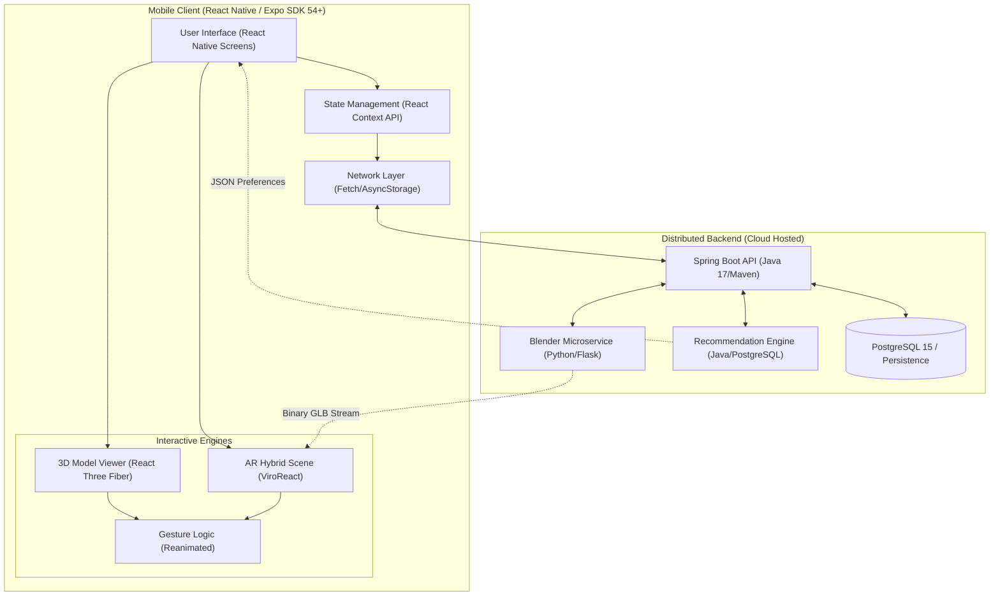
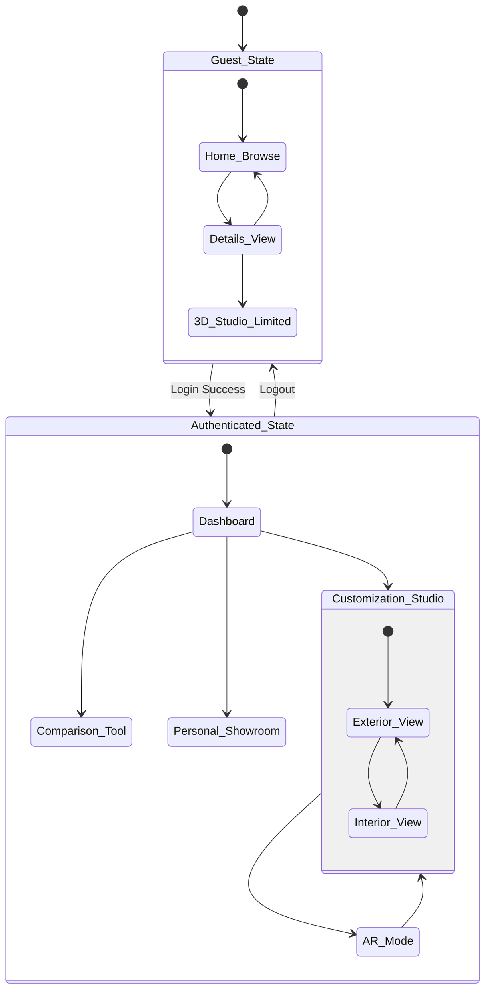
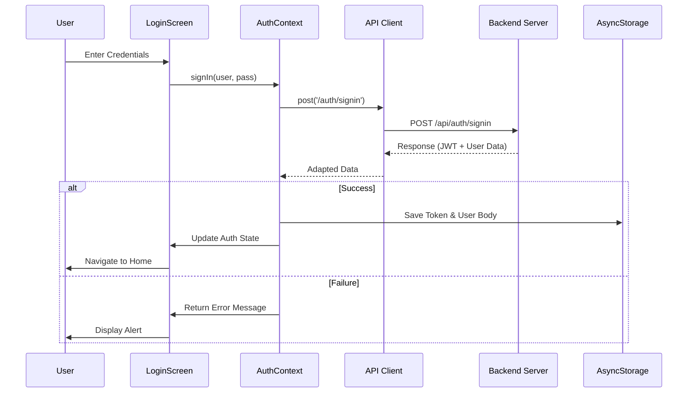
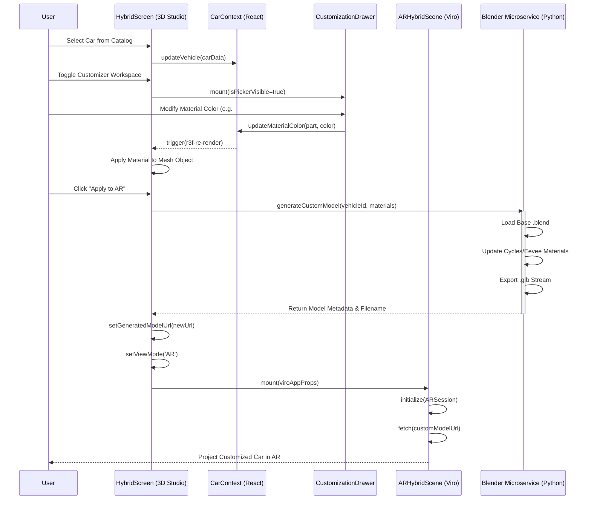
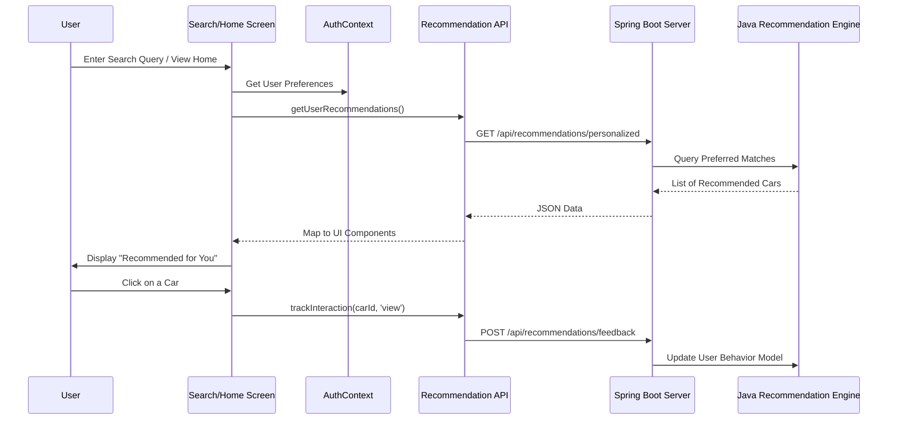
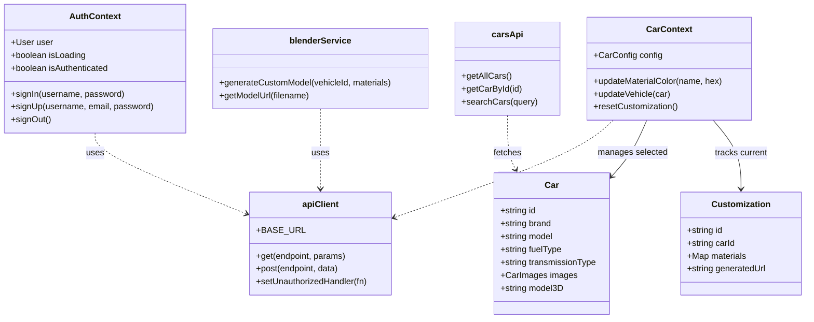
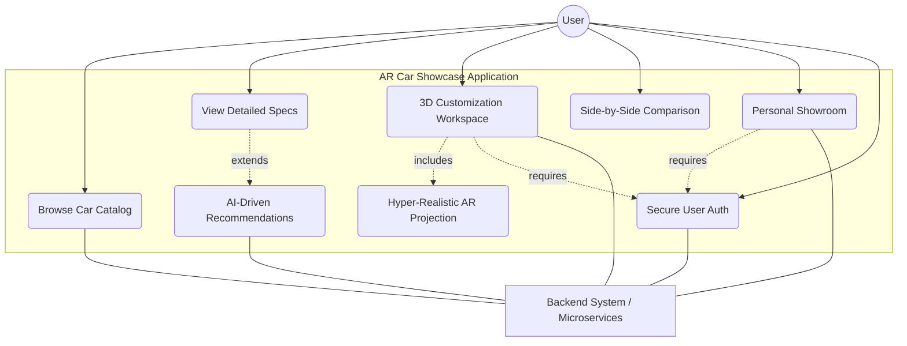

# 🚗 AR Car Showcase

An immersive **Augmented Reality Car Showcase** mobile app built with **React Native**, **Expo**, and **ViroReact**. Browse a full car catalog, customize colors in a real-time 3D studio, and experience vehicles in your real-world environment through Augmented Reality.

---

## 🛠️ Tech Stack

| Technology | Version |
|---|---|
| React Native | 0.81.5 |
| Expo | ~54.0.32 |
| Expo Router | ~6.0.22 |
| TypeScript | ~5.9.2 |
| ViroReact (`@reactvision/react-viro`) | ^2.43.6 |
| Three.js | ^0.182.0 |
| React Three Fiber | ^9.5.0 |
| React Three Drei | ^10.7.7 |
| React Navigation | ^7.x |
| React Native Reanimated | ~4.1.1 |

---

## ✨ Features

- 🔭 **Augmented Reality** – View 3D car models in your real environment using ViroReact (ARCore/ARKit)
- 🎨 **Color Customization** – Customize car body, rims, interior, carbon fiber, and more per material slot
- 🚘 **3D Model Viewer** – Explore detailed `.glb` / `.obj` models with pinch-to-zoom and swipe-to-rotate
- 📱 **Cross-Platform** – Supports Android and iOS
- 🗂️ **File-Based Routing** – Powered by Expo Router for seamless navigation
- 🌗 **Light/Dark Theme** – System-aware theme that persists via AsyncStorage
- 🔐 **Auth-Gated Features** – Login-required modal for protected features (AR, saving, customizing)
- 🎞️ **Animated Tab Bar** – Smart scroll-aware tab bar that hides/shows on scroll
- 🤖 **AI Recommendations** – Personalized car suggestions based on user preferences

---

## 🏗️ Frontend Architecture

### Overview

The frontend is built using a **layered, context-driven architecture**. State management is handled entirely with React Context (no Redux), custom hooks abstract all 3D/scene logic, and Expo Router handles navigation via a file-based system.

```
┌─────────────────────────────────────────────────┐
│                   Expo Router                   │
│         (File-based Navigation + Layouts)        │
├─────────────────────────────────────────────────┤
│               React Context Layer               │
│  AuthContext │ CarContext │ ThemeContext │        │
│              ScrollContext                       │
├─────────────────────────────────────────────────┤
│              Screen / Page Layer                │
│  app/(main)/  │  app/auth/  │  app/scenes/      │
├─────────────────────────────────────────────────┤
│             Component Layer                     │
│  CarCard │ CustomizerScreen │ AnimatedTabBar     │
│  ColorPicker │ CustomizationDrawer │ Modals      │
├─────────────────────────────────────────────────┤
│             Custom Hooks Layer                  │
│  useModelSource │ useSceneMaterials              │
│  useTouchGestures │ useSceneCleanup              │
│  useSmartScroll                                  │
├─────────────────────────────────────────────────┤
│           3D / AR Rendering Layer               │
│  React Three Fiber Canvas │ ViroReact AR Scene  │
│  Three.js Materials & Scene Graph               │
└─────────────────────────────────────────────────┘
```

---

## 🌐 System Architecture Diagram



---

## 🔄 State Machine Diagram



---

## 🔄 Sequence Diagram: Authentication Flow



---

## 🔄 Sequence Diagram: 3D Studio & AR Flow



---

## 🔄 Sequence Diagram: Recommendation & Search Flow



---

## 📊 Class Diagram: Core Logic & Contexts



---

## 🎭 Use Case Diagram



---

## 🚀 Getting Started

### Prerequisites

- [Node.js](https://nodejs.org/) 18+
- [Expo CLI](https://docs.expo.dev/get-started/installation/)
- Android / iOS device or emulator with camera support

### Installation

1. **Clone the repository**
   ```bash
   git clone https://github.com/AdepuSriCharan/AR-Car-Showcase.git
   cd AR-Car-Showcase
   ```

2. **Install dependencies**
   ```bash
   npm install
   ```

3. **Start the development server**
   ```bash
   npx expo start
   ```

4. **Run on your device**
   - For full AR support, use a **development build**:
     ```bash
     npx expo run:android
     # or
     npx expo run:ios
     ```

---

## 📱 Available Scripts

| Script | Description |
|---|---|
| `npm start` | Start the Expo development server |
| `npm run android` | Run on Android device/emulator |
| `npm run ios` | Run on iOS simulator |
| `npm run web` | Run in web browser |
| `npm run lint` | Run ESLint |
| `npm run reset-project` | Reset to blank project starter |

---

## 🎨 3D Customization: Material Slots

| Slot ID | Label |
|---|---|
| `CAR_BODY_PRIMARY` | Main Body |
| `CAR_BODY_SECONDARY` | Accent Finish |
| `CAR_INTERIOR_1` | Dashboard & Console |
| `CAR_INTERIOR_2` | Seat Upholstery |
| `CAR_INTERIOR_3` | Interior Trims |
| `CAR_RIM` | Wheel Rims |
| `CARBON_MATERIAL_1` | Carbon Fiber |

---

## ⚙️ R3F vs. ViroReact: The Hybrid Architecture

| Feature | React Three Fiber (R3F) | Viro React (AR) |
|---|---|---|
| **Environment** | Purely virtual (controlled studio) | Real-world camera feed |
| **Tracking** | None — controlled by touch gestures | 6DoF — tracks physical device movement |
| **Material Control** | Full Three.js scene graph access | Limited — model loaded as-is |
| **Use Case** | Customization studio | "Will this fit in my garage?" |

---

## 🔗 Related Repositories

- **[AR-Car-Showcase-Server](https://github.com/AdepuSriCharan/AR-Car-Showcase-Server)** – Spring Boot backend + Python Blender microservice

---

## 📄 License

This project is private.
